# Recosearch - Personalized Academic Paper Recommendation System
The aim of this project is to facilitate literature review and article reading processes by providing article suggestions for research areas using the articles in the hands of researchers.

The basic flow is as follows:
1. The user creates an article group in the system.
2. The user adds the articles that they have already collected and reviewed to the article group.
3. The system extracts features such as abstracts and keywords of the articles in the article group.
4. The system searches for articles on [arXiv](https://arxiv.org/) through the extracted keywords.
5. The system measures their similarity by comparing the abstracts of the articles in the search results with the abstracts of the articles in the article group.
    - This similarity score is referred to as "**Relation Score**". Articles that achieve a similarity score above 10% are recommended to the user.
    - Articles that achieve a similarity score above 5% are also displayed as "**Related Articles**" for possible review at the user's request.
6. If a detailed analysis is requested from the recommended articles, similarity scores are calculated by comparing the full text of the selected article with the full texts of the articles in the article group.
    - This similarity score is referred to as "**Similarity Score**".

## Project Structure

1. **recosearch**: Contains the codes used during research, where the basic background flow is tested.
2. **RecosearchWeb**: Contains the codes of the web application developed with Django.

## Screenshots

### Home Page

### Login

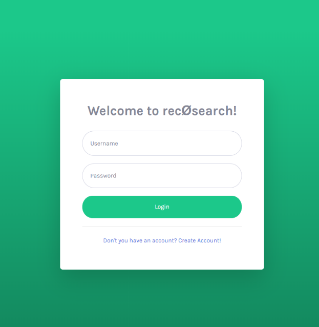

### Register

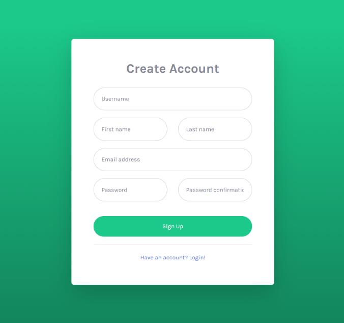

### Dashboard

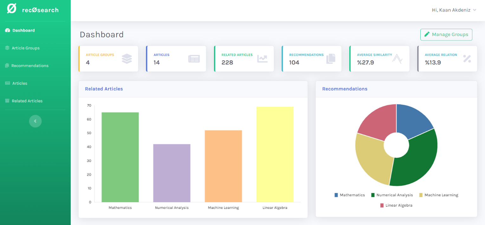

### Article Groups

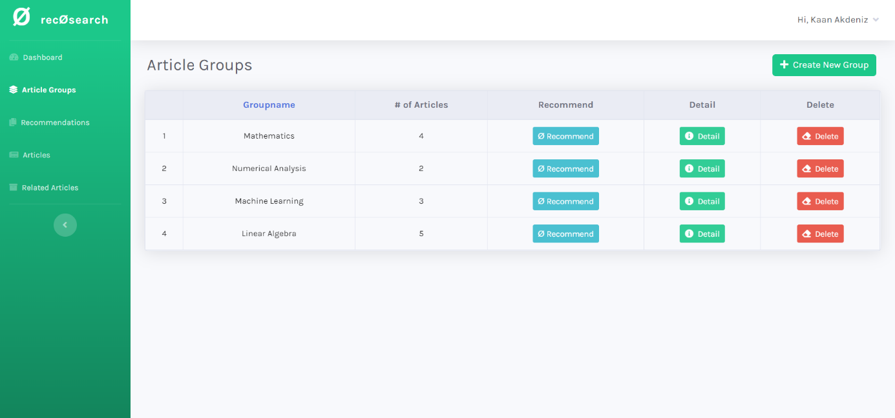

### Article Group Detail

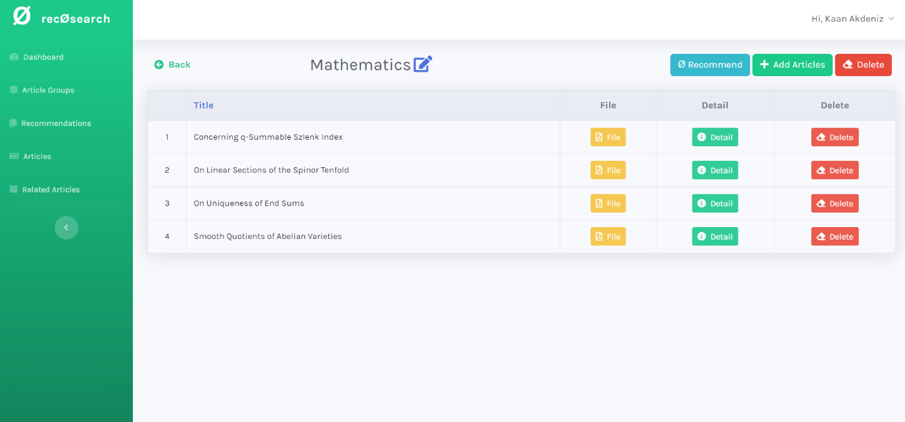

### Article Detail

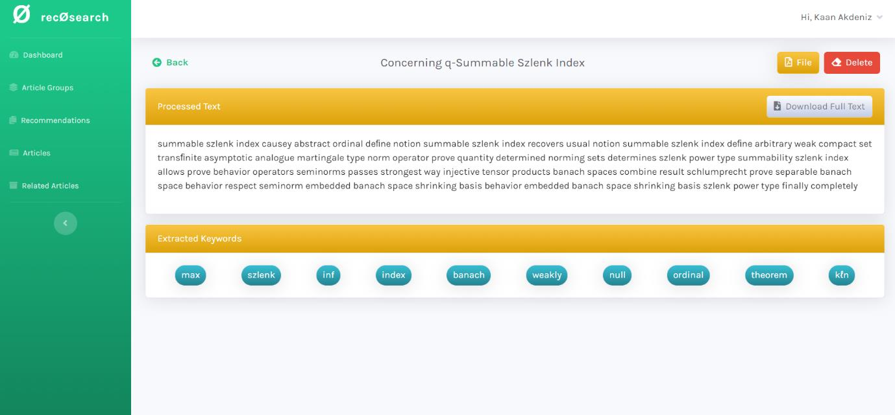

### Article Detail Analyzed

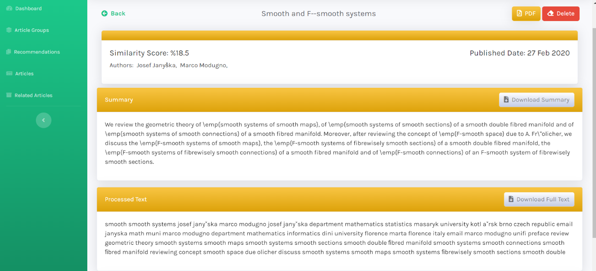

### Recommendations for An Article Group

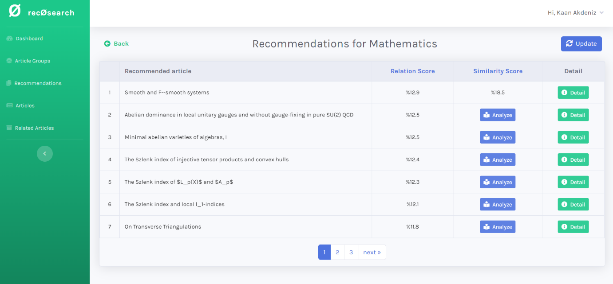

### All Recommendations

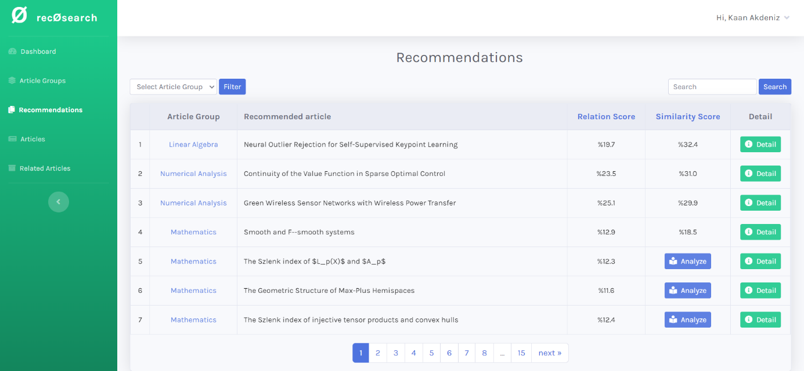

### All Articles

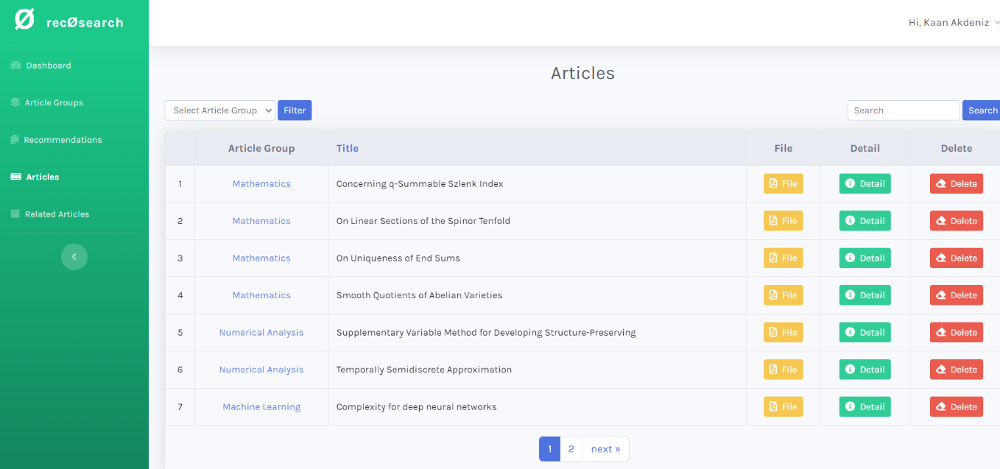

### Related Articles

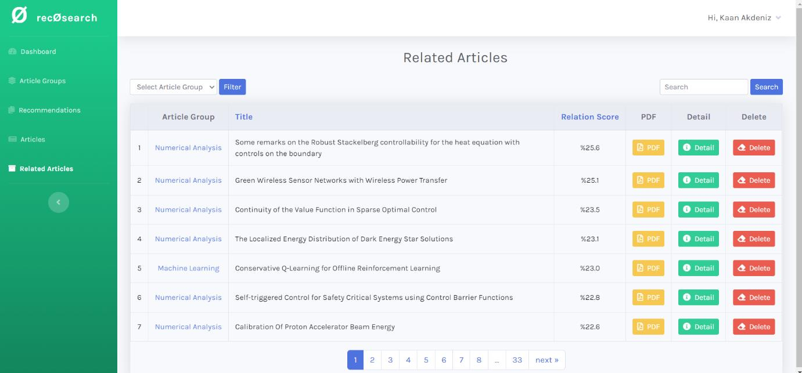

### Notes & TODO
The project dependencies are not up to date, and problems may be encountered when trying to run it.

- [ ] Move project to poetry
- [ ] Update dependencies
- [ ] Add Docker option
- [ ] Deploy
